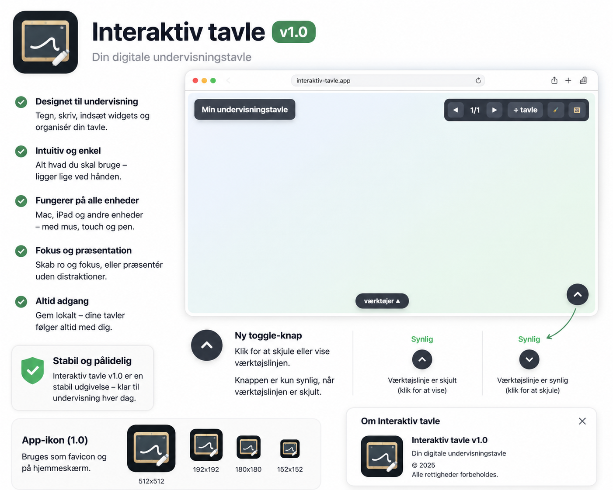

# Interaktiv tavle v1.0.2

En enkel, lokal webapp til at bygge interaktive undervisningstavler direkte i browseren.

Appen kan bruges til korte oplæg, klasseaktiviteter, gruppearbejde, afstemninger, lodtrækning, ordskyer, timere og visuelle tavler med tekst, billeder, video, links og PDF.

## Udgivelse

**Version:** 1.0  
**Status:** stabil første udgivelse  
**Format:** single-file webapp med lokale ikoner/manifest

## Brug appen online

Åbn appen direkte i browseren:

https://maans.github.io/Tavle/

Alt arbejde foregår lokalt i browseren. Der kræves ingen login, server eller database.

## Download lokal kopi

Vil du have en lokal kopi med `index.html`, ikoner, manifest og README:

https://github.com/maans/Tavle/archive/refs/heads/main.zip

Pak ZIP-filen ud og åbn `index.html` i en moderne browser.

## Værktøjer

Du kan indsætte tekst, YouTube-video, tegning, hjul, grupper, ordsky, afstemning, timer, billede, link, PDF, baggrund og ur.

## Lister

`Hent liste` kan bruges i hjul, grupper og ordsky. Det kan hente gemte lister og importere tekst-/CSV-/TSV-/regnearksfiler.

Tekstwidgetten er bevidst holdt enkel og har ikke listeimport i v1.0.

## Tavler

Du kan have flere tavler i samme fil og skifte mellem dem med pilene.

## Redigering, præsentation og fokus

I redigering kan du flytte, rotere, ændre og oprette widgets.

I præsentation skjules redigeringsgrej, så tavlen er roligere foran elever.

Fokus kan fremhæve én widget og dæmpe resten.

## Toolbar

Værktøjslinjen styres med den faste vis/skjul-knap nederst til højre. Auto-hide og pin-funktion er fjernet for at gøre appen mere stabil på Mac, iPad, touch og mus.

## Browserapp / iPad

Releasepakken indeholder app-ikoner og `manifest.webmanifest`, så appen fungerer bedre som browserapp / “Føj til hjemmeskærm”.

## Backup

Brug `Mere → backup` til at gemme eller åbne tavlefiler.

## Privat og lokalt

Appen gemmer som udgangspunkt data i browserens localStorage. Indholdet sendes ikke til en server.

## Nyt: kontekstuelle hints

Appen viser nu små, diskrete hints nederst på tavlen i stedet for et tungt grafisk hjælpelag.

Hints skifter automatisk efter situationen:

- Når ingen widget er valgt: klik på en widget eller tilføj nyt indhold.
- Når en widget er valgt: `F` for fokus og `Shift + F` for maksimering.
- Når du skriver i tekst: `Esc` stopper skrivning og beholder widgetten valgt.
- I præsentation: hints viser hvordan du vælger, fokuserer og vender tilbage.

Hints er lavet som let HTML/CSS og forstørrer derfor ikke `index.html` med indlejrede billeder.

Hints kan slås til/fra med `Shift + O`. De vises i redigering, men skjules som udgangspunkt i præsentation, så elevvisningen forbliver rolig.

v1.0.39: Den interne knap “Rediger link” i link-widgetten er skjult. Link kan stadig redigeres ved oprettelse og via dobbeltklik i redigering.

v1.0.40: Link-widgetten har nu en lille rediger-knap i topbjælken i redigeringstilstand, mens den store interne “Rediger link”-knap fortsat er skjult.

## Baggrunde opdateret

Denne pakke bruger optimerede WebP-baggrunde i `backgrounds/` (`bg1.webp` – `bg15.webp`) i stedet for de tidligere PNG-filer. `index.html` er kun ændret i baggrundsbibliotekets `src`/`name`-felter, så appens øvrige funktioner er bevaret.
